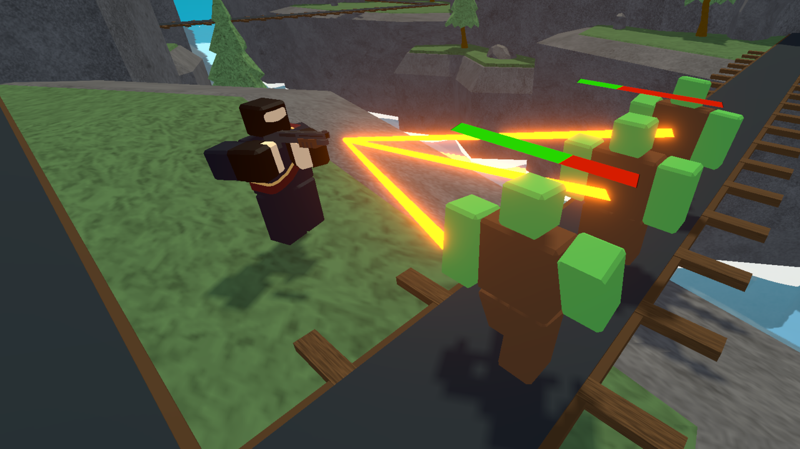
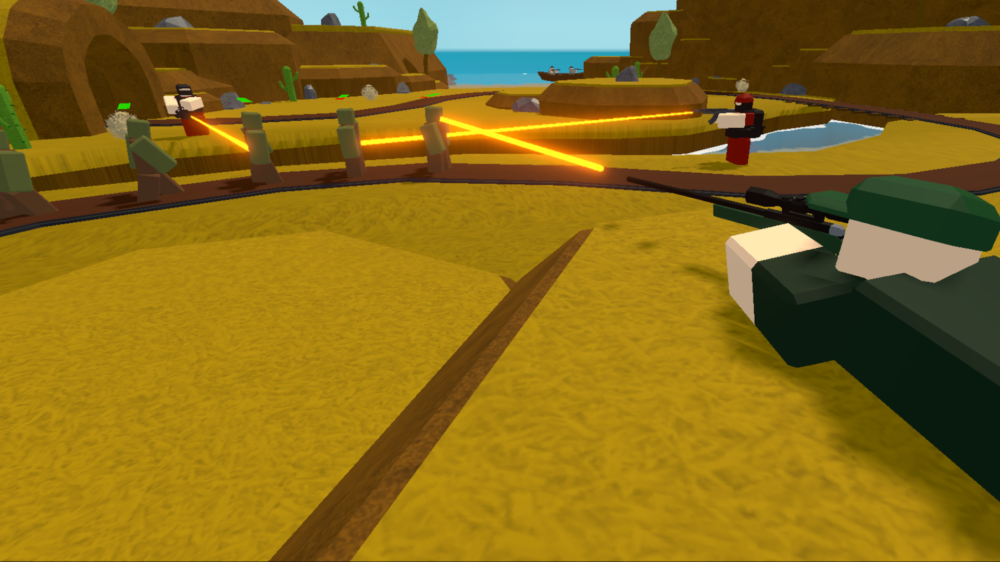
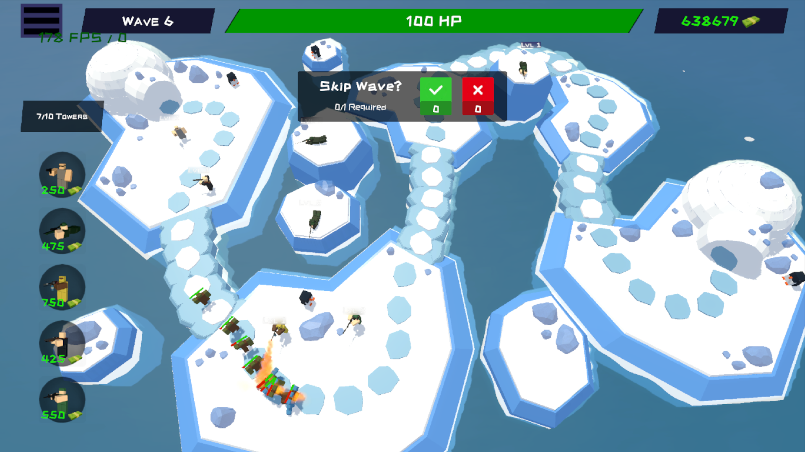

# 🧱 Blocky Patrol: Tower Defense

**Blocky Patrol** is a colorful **Tower Defense** game available on **Google Play**.  
Defend your base against waves of zombies using strategic tower placements — all in a fun low-poly world!

---

## 🎮 Overview

Your mission: survive endless waves of enemies, upgrade your towers, and refine your defensive strategy.  
With its minimalistic voxel style and smooth gameplay, **Blocky Patrol** offers a refreshing take on the tower defense genre — perfect for both casual and tactical players.

---

## 🔗 Links

- 📱 **Google Play:** [https://play.google.com/BlockyPatrol](https://play.google.com/store/apps/details?id=com.MMK.BlockyPatrol)
- 📺 **Trailer:** *[https://www.youtube.com/BlockyPatrol/trailer](https://www.youtube.com/watch?v=AFc3RcBRVz8)*

---

## 🧩 Key Features

- Classic **Tower Defense** gameplay with voxel-style visuals  
- Intuitive and clean UI  
- Multiple tower and enemy types  
- Upgrade system and progressive difficulty  
- Free-to-play with ads  

---

## 🖼️ Screenshots

  
  

---

## ⚙️ Technical Details

- Version: (33) 1.3.3  
- Size: ~176 MB  
- Platform: Android 7.0+  
- Mode: Online  

---

## 👤 Developer

**MMK Games Studio**  
📧 Contact: [maksgamedev@gmail.com]  
🌐 Portfolio / Website: [https://portfolio-page](https://portfolio-page-makschojniaks-projects.vercel.app/)

---

## 🚀 Download & Play

👉 [Get it on Google Play](https://play.google.com/store/apps/details?id=com.MMK.BlockyPatrol)
